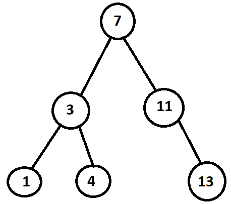
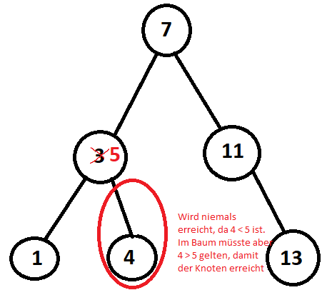

---
title: "Aufgaben 3 - Automatische Zeiger"
author: [Jannik Steinbach, Thore Böger, Johannes Städter]
date: "28. 01. 2022"
...

# Aufgaben 3 - Automatische Zeiger

## Aufgabe 1

### a)

In Zeile 16 wird ein C-Zeiger namens `child` auf eine `node` mit dem Namen `child` erstellt. Der Zeiger `child` wird in Zeile 17 an den smart Pointer namens `child_ptr` weitergegeben. Hierdurch wird der Quellzeiger geändert und zu einem `nullptr` gesetzt. In Zeile 20 wird der Originale C-Zeiger namens `child` gelöscht und somit wird ein automatisch verwaltetes Objekt gelöscht, was nicht zulässig ist.

### b)

Die Lösung wäre hier den automatischen Zeiger und das zugehörige Objekt in einer einzelnen Anweisung zu initialisieren und native C-Zeiger bei der Verwendung von Smart Pointern nicht verwendet.

Also: `std::auto_ptr<node> child_ptr(new node("child"));`

## Aufgabe 2

### a)

Durch Referenzzirkel kann trotzdem ein Speicherleck entstehen. Smart Pointer minimieren jedoch das Risiko deutlich.

### b)

Siehe `src/{rc.cpp, rc.hpp, string_shared_ptr.cpp, string_shared_ptr.hpp, string_weak_ptr.cpp, string_weak_ptr.hpp}`.

Die String Implementierung (`string.cpp, string.hpp`) wurde aus der Bearbeitung der Aufgabe 2 übernommen.

### c)

Shared Pointer sollten nur verwendet werden, wenn es ein Objekt gibt, die von mehreren Funktionen gelesen / geändert werden und das Kopieren dieses Objekts aufwendig ist. Wird ein Objekt nur von einer Funktion verwendet, sollte man Unique Pointer verwenden. Da Shared Pointer noch ein weiteres Objekt, das Referenzzählerobjekt, verwalten, entstehen bei exzessiver Verwendung von Shared Pointern Performanceeinbußen.

Erzeugen und Kopieren von Shared Pointern ist langsam, eventuell Unique Pointer oder Referenzen verwenden.

### d)

| Zeile | Referenzzähler | Begründung                                                                                                                                           |
| ----- | -------------- | ---------------------------------------------------------------------------------------------------------------------------------------------------- |
| 13    | 1              | Shared Pointer `n1` wird erzeugt, also wird der Referenzzeiger erhöht.                                                                               |
| 16    | 2              | Shared Pointer `n3` wird aus Shared Pointer `n1` erzeugt. Somit wird `n1` kopiert und es entsteht ein neuer Shared Pointer auf den Wert hinter `n1`. |
| 17    | 3              | Shared Pointer `n1` wird als `child` im `root`-Knoten angefügt. Somit entsteht ein weiterer Shared Pointer auf den Wert hinter `n1`.                 |
| 21    | 4              | Der `parent` von `n2` ist `n1` somit erzeugt `.lock()` auf `n1` einen weiteren Shared Pointer.                                                       |
| 23    | 3              | Hier ist der Scope, der in Zeile 15 Erstellt wurde vorbei, deswegen wird zunächst der Shared Pointer aus Zeile 21 gelöscht.                          |
| 23    | 2              | Hier wird der Zeiger aus Zeile 17 gelöscht.                                                                                                          |
| 23    | 1              | Hier wird der Zeiger aus Zeile 16 gelöscht.                                                                                                          |
| 25    | 0              | Hier wird `n1` mit `.reset()` zurückgesetzt, weshalb der Referenzzähler um 1 verringert wird und somit läuft der Destruktor.                         |

\pagebreak

### e)

Baum `b` sieht zunächst so aus:



Die Text `Vier gewinnt.` wird nie ausgegeben, da der Knoten `4` nie erreicht werden kann.



Ähnlich wie bei

```cpp
b->find_node(3)->value = 5;

if (b->find_node(4)) std::cout << "Vier gewinnt.";
```

können Texturen-(Weak-)Pointer, die auf ein nachfolgendes (Child-)Texturen-Objekt zeigen, bei Manipulation oder Löschen des Parentnode `std::set<std::weak_ptr<texture>>` nicht mehr gefunden werden.
